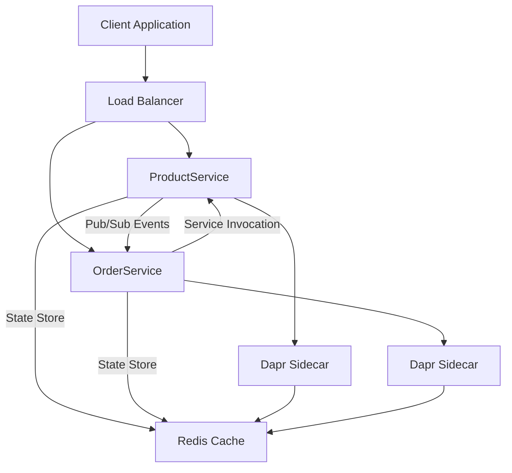

# Cloud-Native Microservices with Dapr - Product & Order Services

A production-ready microservices application built with .NET 8, demonstrating cloud-native patterns with Dapr service mesh, containerization, and Azure Container Apps deployment.

## 🏗️ Architecture Overview

This solution demonstrates a modern cloud-native microservices architecture with the following components:

### Services
- **ProductService**: RESTful API for product catalog management (CRUD operations, inventory tracking)
- **OrderService**: Order processing service with product integration and inventory updates
- **Dapr Runtime**: Service mesh providing communication, state management, and pub/sub messaging

### Infrastructure Components
- **Redis**: State store and pub/sub message broker
- **Azure Container Apps**: Serverless container orchestration platform
- **Bicep Templates**: Infrastructure as Code for Azure deployment
- **Podman**: Local container runtime for development

### Communication Patterns



## 📁 Project Structure

```
├── src/
│   ├── ProductService/           # Product management Web API
│   │   ├── Controllers/          # API controllers
│   │   ├── Services/            # Business logic layer
│   │   ├── Data/                # Entity Framework DbContext
│   │   ├── Validators/          # FluentValidation rules
│   │   └── Dockerfile           # Multi-stage production build
│   ├── OrderService/            # Order processing Web API
│   │   ├── Controllers/         # API controllers
│   │   ├── Services/           # Business logic with Dapr integration
│   │   ├── Data/               # Entity Framework DbContext
│   │   ├── Validators/         # FluentValidation rules
│   │   └── Dockerfile          # Multi-stage production build
│   ├── Shared/                 # Common models, DTOs, and contracts
│   │   ├── Models/             # Domain entities
│   │   ├── DTOs/               # Data transfer objects
│   │   └── Events/             # Event schemas for pub/sub
│   └── Tests/                  # Unit and integration tests
│       ├── ProductService.Tests/
│       ├── OrderService.Tests/
│       └── Shared.Tests/
├── infrastructure/
│   ├── dapr/                   # Dapr component configurations
│   │   ├── secrets.yaml        # Secret store configuration
│   │   ├── statestore.yaml     # Redis state store
│   │   └── pubsub.yaml         # Redis pub/sub broker
│   ├── azure/                  # Azure Bicep deployment templates
│   │   ├── main.bicep          # Main infrastructure template
│   │   ├── container-apps.bicep # Container Apps configuration
│   │   └── monitoring.bicep     # Application Insights & Log Analytics
│   └── docker/                 # Development compose files
├── scripts/                    # Automation scripts
│   ├── build-images.sh         # Container image build automation
│   ├── run-containers.sh       # Local development with containers
│   ├── start-dev.sh           # Native development with Dapr
│   └── deploy-azure.sh        # Azure deployment automation
└── docs/                      # Additional documentation
```

## 🛠️ Technology Stack

### Backend
- **.NET 8**: Latest LTS version with performance improvements
- **ASP.NET Core**: Web API framework with built-in dependency injection
- **Entity Framework Core**: ORM for data persistence with in-memory provider
- **FluentValidation**: Input validation with fluent syntax
- **Serilog**: Structured logging with multiple sinks

### Cloud-Native & DevOps
- **Dapr v1.15**: Service mesh for microservices communication
- **Redis 7-alpine**: High-performance in-memory data store
- **Podman**: Secure, rootless container runtime
- **Azure Container Apps**: Serverless Kubernetes-based platform
- **Azure Bicep**: Infrastructure as Code with strong typing

### Development & Testing
- **xUnit**: Unit testing framework with excellent .NET integration
- **Moq**: Mocking framework for isolated unit tests
- **FluentAssertions**: Fluent test assertions for readable tests
- **Microsoft.AspNetCore.Mvc.Testing**: Integration testing for Web APIs

## 🚀 Getting Started

### Prerequisites
```bash
# Required tools
.NET 8 SDK (8.0.100 or later)
Dapr CLI (1.15.0 or later)
Podman (5.0 or later)
Azure CLI (2.60 or later) # For Azure deployment

# Verify installations
dotnet --version
dapr --version  
podman --version
az --version
```

### 1. Local Development (Native - Fastest for development)

```bash
# Clone and setup
git clone <repository-url>
cd <project-directory>

# Install Dapr components
dapr init

# Start services with hot reload
./scripts/start-dev.sh

# Services will be available at:
# ProductService: http://localhost:5001
# OrderService: http://localhost:5002
# Dapr Dashboard: http://localhost:8080
```

### 2. Local Development (Containers - Production-like)

```bash
# Build container images
./scripts/build-images.sh

# Start containerized services
./scripts/run-containers.sh

# Services will be available at:
# ProductService: http://localhost:5001
# OrderService: http://localhost:5002
# Redis Insight: http://localhost:8001 (if enabled)
```

### 3. Testing the APIs

```bash
# Get all products
curl http://localhost:5001/api/products | jq

# Create a new product
curl -X POST http://localhost:5001/api/products \
  -H "Content-Type: application/json" \
  -d '{
    "name": "Test Product",
    "description": "A test product",
    "price": 99.99,
    "stock": 100
  }' | jq

# Create an order
curl -X POST http://localhost:5002/api/orders \
  -H "Content-Type: application/json" \
  -d '{
    "productId": "<product-id-from-above>",
    "customerName": "John Doe",
    "customerEmail": "john@example.com",
    "quantity": 2
  }' | jq
```

## 🧪 Testing

### Running Unit Tests

```bash
# Run all tests
dotnet test

# Run tests with coverage
dotnet test --collect:"XPlat Code Coverage"

# Run specific test project
dotnet test src/Tests/ProductService.Tests/

# Run tests in watch mode (during development)
dotnet watch test src/Tests/ProductService.Tests/
```

### Test Categories
- **Unit Tests**: Fast, isolated tests for business logic
- **Integration Tests**: API endpoint testing with in-memory database
- **Service Tests**: Dapr integration and service communication tests

### Sample Test Commands

```bash
# Test ProductService endpoints
curl -X GET http://localhost:5001/health
curl -X GET http://localhost:5001/api/products

# Test OrderService endpoints  
curl -X GET http://localhost:5002/health
curl -X GET http://localhost:5002/api/orders

# Test service communication
curl -X POST http://localhost:5002/api/orders \
  -H "Content-Type: application/json" \
  -d '{"productId":"<id>","customerName":"Test","customerEmail":"test@test.com","quantity":1}'
```

## � Container Deployment

### Local Container Development

```bash
# Build all images
./scripts/build-images.sh

# Start all services with Dapr sidecars
./scripts/run-containers.sh

# View running containers
podman ps --format "table {{.Names}}\t{{.Status}}\t{{.Ports}}"

# View logs
podman logs -f productservice
podman logs -f orderservice
```

### Container Architecture

- **Multi-stage builds** for optimized production images
- **Non-root user** for security
- **Health checks** for reliability
- **Dapr sidecars** for service mesh capabilities
- **Custom networking** for service isolation

## ☁️ Azure Container Apps Deployment

### Quick Deploy

```bash
# Login to Azure
az login

# Deploy everything (Resource Group, Container Registry, Container Apps)
./scripts/deploy-azure.sh \
  --resource-group myapp-rg \
  --location eastus2 \
  --registry-name myappregistry
```

### Manual Deployment Steps

```bash
# 1. Create resource group
az group create --name myapp-rg --location eastus2

# 2. Deploy infrastructure
az deployment group create \
  --resource-group myapp-rg \
  --template-file infrastructure/azure/main.bicep \
  --parameters location=eastus2

# 3. Build and push images
./scripts/build-images.sh --registry myappregistry.azurecr.io

# 4. Deploy container apps
az containerapp update \
  --resource-group myapp-rg \
  --name productservice \
  --image myappregistry.azurecr.io/productservice:latest
```

## 🔧 Development Workflow

### Code Quality Standards
- **Clean Architecture**: Separation of concerns with clear boundaries  
- **SOLID Principles**: Maintainable and extensible code design
- **Domain-Driven Design**: Rich domain models with business logic
- **API-First**: OpenAPI/Swagger documentation for all endpoints

### Development Process
1. **Feature Branch**: Create feature branches from main
2. **Unit Tests**: Write tests before implementation (TDD)
3. **Code Review**: Peer review with architectural guidance
4. **Integration Tests**: Validate service interactions
5. **Container Testing**: Verify containerized deployment
6. **Azure Deploy**: Deploy to staging environment

## 📊 Monitoring & Observability

### Application Insights Integration
- **Telemetry**: Automatic request/response tracking
- **Dependencies**: Database and external service calls
- **Performance**: Response times and throughput metrics
- **Errors**: Exception tracking with stack traces

### Dapr Observability
- **Metrics**: Service mesh performance indicators
- **Tracing**: Distributed request tracing across services
- **Logging**: Structured logs with correlation IDs

### Health Checks
- **Startup**: Database connectivity and Dapr readiness
- **Readiness**: Service availability for traffic
- **Liveness**: Service health for restart decisions

## 🏭 Production Considerations

### Security
- **HTTPS Only**: TLS encryption for all communications
- **API Keys**: Secured endpoints with authentication
- **Secrets Management**: Azure Key Vault integration
- **Network Isolation**: VNET integration and private endpoints

### Scalability
- **Horizontal Scaling**: Container Apps automatic scaling
- **Resource Limits**: CPU and memory constraints
- **Load Testing**: Performance validation under load
- **Circuit Breakers**: Fault tolerance patterns

### Reliability
- **Health Checks**: Kubernetes-native health monitoring
- **Graceful Shutdown**: Clean resource disposal
- **Retry Policies**: Exponential backoff with jitter
- **Bulkhead Pattern**: Failure isolation

## 📚 Additional Resources

### Documentation
- [Dapr Documentation](https://docs.dapr.io/)
- [Azure Container Apps Documentation](https://docs.microsoft.com/en-us/azure/container-apps/)
- [.NET 8 Documentation](https://docs.microsoft.com/en-us/dotnet/)

### Development Guides
- [Local Development Setup](./docs/local-development.md)
- [Testing Strategies](./docs/testing.md)
- [Azure Deployment Guide](./docs/azure-deployment.md)
- [Troubleshooting Guide](./docs/troubleshooting.md)

## 🤝 Contributing

1. Fork the repository
2. Create a feature branch (`git checkout -b feature/amazing-feature`)
3. Commit your changes (`git commit -m 'Add amazing feature'`)
4. Push to the branch (`git push origin feature/amazing-feature`)
5. Open a Pull Request

## 📈 Roadmap

### Phase 1: Foundation ✅
- [x] .NET 8 microservices with Entity Framework
- [x] Dapr service mesh integration
- [x] Containerization with security best practices
- [x] Azure Container Apps infrastructure

### Phase 2: Enhanced Features (Next)
- [ ] Comprehensive unit and integration test suites
- [ ] API versioning and backward compatibility
- [ ] Advanced monitoring with Application Insights
- [ ] Performance testing and optimization

### Phase 3: Production Ready (Future)
- [ ] Authentication and authorization (Azure AD)
- [ ] OTEL observability and distributed tracing
- [ ] GitOps deployment with Azure DevOps
- [ ] Chaos engineering and resilience testing

## 📄 License

This project is licensed under the MIT License - see the [LICENSE](LICENSE) file for details.

---

## 🎯 Quick Commands Reference

```bash
# Development
./scripts/start-dev.sh              # Native development
./scripts/run-containers.sh         # Container development
./scripts/build-images.sh           # Build container images

# Testing  
dotnet test                         # Run all tests
dotnet test --watch                 # Watch mode testing
curl http://localhost:5001/health   # Health check

# Deployment
./scripts/deploy-azure.sh           # Deploy to Azure
az containerapp logs show           # View container logs
podman logs -f productservice       # Local container logs
```

**Built with ❤️ using .NET 8, Dapr, and Azure Container Apps**
